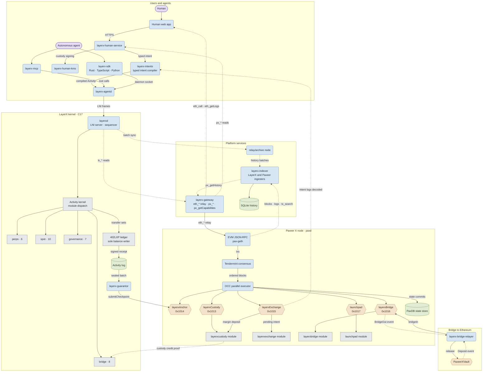
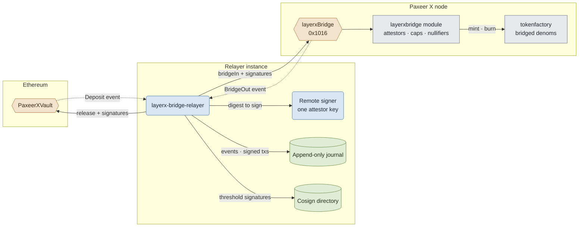

<p align="center"></p>

<h1 align="center">Paxeer X Network</h1>

Paxeer X Network — one network: the Paxeer EVM chain and the LayerX agent-native domain behind one interface.

English · [Español](docs/readme/README.es.md) · [日本語](docs/readme/README.ja.md) · [Русский](docs/readme/README.ru.md) · [简体中文](docs/readme/README.zh-CN.md) · [Português](docs/readme/README.pt-BR.md) · [Deutsch](docs/readme/README.de.md) · [Français](docs/readme/README.fr.md)

[](LICENSE)
[](.github/workflows/ci.yml)

## What Paxeer X Network is

Paxeer X Network is a deterministic execution and accounting network for autonomous agents. Every state-changing operation enters as a signed, canonically encoded `Activity`. The protocol verifies the actor and its authority, consumes the account sequence, orders the activity on one global sequence, applies a deterministic state transition, and returns a signed receipt tied to the resulting state root.

The append-only activity log is the authority. Database indexes are disposable projections and can be rebuilt by replaying that log. Consensus-critical execution excludes floating point, local clock decisions, database iteration order, and other sources of nondeterminism. `402LXP` is the only component allowed to write balances. Protocol modules emit validated transfer sets rather than mutating funds themselves.

Ordinary agent activity is executed and ordered inside LayerX. Periodic checkpoints settle to Paxeer, which holds custody, checkpoint registration, guarantor bonds, challenges, withdrawals, disputes, and emergency exits. An ordinary LayerX action does not require a Paxeer transaction.

This repository is the Sidiora Labs monorepo for Paxeer X Network: the Paxeer chain and the LayerX domain in one repository. Co-location keeps the protocol, settlement network, contracts, and developer surfaces auditable in one place. Each subsystem keeps its own build, release, deployment, and trust boundary. See [`spec/layerx-protocol/design.md`](spec/layerx-protocol/design.md).

## Try the network

The cluster path is [`docs/wiki/Quickstart.md`](docs/wiki/Quickstart.md): install the `layerx` CLI from `platform/cli`, bring up the cluster, source `build/beta-cluster/env`, then create a credential, claim from the faucet, submit an activity, verify the receipt, and deploy a program.

The public endpoint checklist is
[`docs/wiki/Getting-Started-Beta.md`](docs/wiki/Getting-Started-Beta.md).
The complete wallet, faucet, Asset, Programs, and HTTP 402 path is
[`docs/wiki/PaymentsQuickstart.md`](docs/wiki/PaymentsQuickstart.md). Native
Asset issuance, public `POST /rpc`, and 402 commitment extras are served by
this tree; the `layerx wallet` / `layerx token` command line and the LXT-20
program token interface are not in it yet. Encodings:
[`docs/wiki/Assets.md`](docs/wiki/Assets.md). RPC methods:
[`docs/wiki/PublicRpc.md`](docs/wiki/PublicRpc.md). Evidence levels:
[`docs/wiki/CommitmentLevels.md`](docs/wiki/CommitmentLevels.md).
An exact real-process transcript of the public payment flow is
[`docs/wiki/PublicAPI.md`](docs/wiki/PublicAPI.md).

```sh
layerx key create quickstart
```

```sh
jq -n --arg did "$LAYERX_TEST_SOURCE_DID" --arg public_key "$LAYERX_TEST_SOURCE_PUBLIC_KEY" \
  '{did:$did, public_key:$public_key}' > faucet-request.json
curl --fail --silent --show-error --max-time 30 --cacert "$LAYERX_TEST_CA_FILE" \
  --header "Authorization: Bearer $(tr -d '\r\n' < "$LAYERX_TEST_AUTH_TOKEN_FILE")" \
  --request POST "$LAYERX_FAUCET_URL/v1/faucet/claims" \
  --header "Idempotency-Key: faucet-quickstart-01" \
  --header 'Content-Type: application/json' --data-binary @faucet-request.json
```

```sh
layerx --json payment test \
  --from "$LAYERX_TEST_SOURCE_DID" \
  --to "$LAYERX_TEST_DESTINATION_DID" \
  --currency "$LAYERX_TEST_ASSET" \
  --amount "$LAYERX_TEST_AMOUNT" \
  --idempotency-key paymentquickstart1
```

```sh
layerx --json receipt verify \
  --receipt receipt.hex \
  --batch-id "$batch_id" \
  --asset "$asset" \
  --previous-state-root "$previous_root" \
  --resulting-state-root "$resulting_root" \
  --sequencer-public-key "$sequencer_key"
```

```sh
layerx --json program deploy \
  quickstart-program/target/wasm32-unknown-unknown/release/quickstart_program.wasm \
  --program-id <program_id> \
  --idempotency-key <idempotency_key> \
  --key quickstart \
  --account-sequence 0 \
  --not-before-ms <not_before_ms> \
  --expires-at-ms <expires_at_ms> \
  --previous-state-root <previous_state_root>
```

## Build from source

The core runtime is C17 (`-std=c17` in the root `Makefile`). Agent, human, and platform workspaces use Rust 1.91.1 (`rust-toolchain.toml`). LayerX settlement contracts use Solidity 0.8.27 (`foundry.toml`). Replay qualification needs GCC 13, Clang 18, Docker, an amd64 musl runner, and an AArch64 cross-compiler plus QEMU; see [`docs/QUALIFICATION.md`](docs/QUALIFICATION.md).

```sh
make build
make test
make test-contracts
make ci
```

Paxeer bounded targets, without changing directories:

```sh
make paxeer-build
make paxeer-lint
make paxeer-test
make paxeer-ci
```

`make ci` runs `public-audit`, native tests, a two-build archive comparison, consensus symbol checks, and sanitizer suites. `make monorepo-ci` is a separate cross-subsystem gate. A local pass is not authorization to deploy contracts, move custody, or handle real assets.

## Repository layout

| Path | Purpose |
| --- | --- |
| `src/`, `include/` | C17 protocol runtime, state machine, storage, sequencing, replay, and settlement integration |
| `cmd/` | Native daemons and tools (`layerxd`, `layerxctl`, genesis, verify) |
| `agent/` | Rust agent interface, SDK, daemon, MCP server, encoding, cryptography, and proof verification |
| `human/` | Human control plane, typed intent compiler, custody-boundary client, explorer index, and web application |
| `platform/` | Developer platform, hosted services, middleware, SDKs, emulator, CLI, and release tooling |
| `programs/` | Programmable LayerX runtime and program tooling |
| `interop/` | Agent-commerce and cross-network interoperability surfaces |
| `contracts/` | Solidity contracts for Paxeer custody, checkpoints, guarantor bonding, claims, disputes, and exits |
| `go.mod`, `chain.mk`, `daemon/`, `node/`, `modules/`, `consensus/`, `sdk/`, `rpc/`, `precompiles/`, `storage/`, `wasm/`, `docker/` | Paxeer Network node, EVM/RPC compatibility, storage engines, modules, contracts, and subsystem-local builds |
| `spec/` | Normative KVX specifications, generated designs, requirements, and task graphs |
| `tests/`, `test/`, `fuzz/` | Native, contract, replay, invariant, fault, and fuzz suites |
| `migrations/` | Genesis, migration, reconciliation, and shadow-replay work |
| `docs/` | Wiki, monorepo notes, and qualification documentation |

## Documentation

- Wiki index: [`docs/wiki/Home.md`](docs/wiki/Home.md)
- Getting started on the network: [`docs/wiki/Getting-Started-Beta.md`](docs/wiki/Getting-Started-Beta.md)
- Payments developer path: [`docs/wiki/PaymentsQuickstart.md`](docs/wiki/PaymentsQuickstart.md)
- Public JSON-RPC: [`docs/wiki/PublicRpc.md`](docs/wiki/PublicRpc.md)
- Assets and tokens: [`docs/wiki/Assets.md`](docs/wiki/Assets.md)
- Commitment levels: [`docs/wiki/CommitmentLevels.md`](docs/wiki/CommitmentLevels.md)
- Monorepo layout and release tags: [`docs/MONOREPO.md`](docs/MONOREPO.md)
- Qualification gates: [`docs/QUALIFICATION.md`](docs/QUALIFICATION.md)
- Specifications: [`spec/`](spec/)

## SDKs and integrations

| Language | Path |
| --- | --- |
| Rust | `agent/crates/layerx-sdk` |
| Python | `agent/sdk/python` |
| TypeScript | `agent/sdk/typescript` |
| Go | `platform/sdk/go` |
| JVM | `platform/sdk/jvm` |
| .NET | `platform/sdk/dotnet` |
| Swift | `platform/sdk/swift` |

`layerx-agentd` is `agent/crates/layerx-agentd`. The MCP server is `agent/crates/layerx-mcp`. The developer CLI in `platform/cli` installs those transports with `layerx install mcp` and `layerx install a2a`.

## Architecture

Paxeer X Network is one network with two execution domains: the Paxeer X chain node (`paxd`, Go) and the LayerX kernel (`layerxd`, C17), joined by EVM precompiles on one side and hosted platform services on the other. Rounded boxes are running services, cylinders are durable stores, hexagons are contracts and EVM precompiles (labelled with their address), and plain boxes are modules inside a state machine. Arrows follow the direction data moves: solid arrows submit or write, dotted arrows carry reads, events and proofs.



The bridge to Ethereum in detail: each relayer instance holds one attestor key behind a remote signer, journals every observed event and signed transaction before broadcast, and meets a signature threshold above one by exchanging signatures with other instances.



## Contributing

Read [`CONTRIBUTING.md`](CONTRIBUTING.md) before opening a pull request. Protocol changes start in `spec/`. Do not disclose a suspected vulnerability in a public issue; follow [`SECURITY.md`](SECURITY.md).

## Security

Report vulnerabilities through GitHub private reporting, as described in [`SECURITY.md`](SECURITY.md).

## License

Licensed under the Apache License, Version 2.0. See [`LICENSE`](LICENSE) and [`NOTICE`](NOTICE).

Paxeer X Network is developed by Sidiora Labs.
